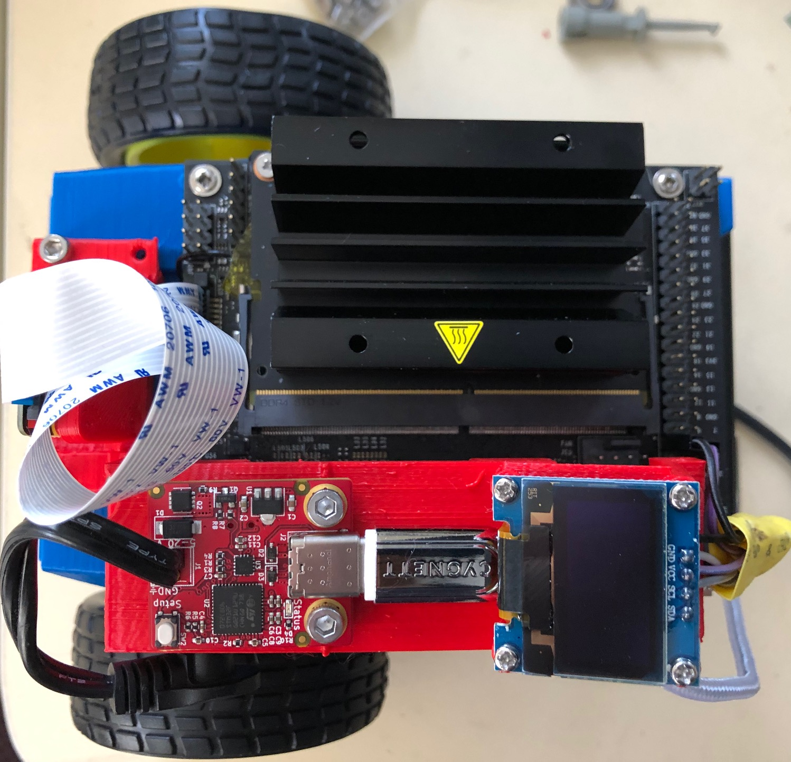

# JetBot

<!-- -->

> Interested in making projects like this with Jetson Nano?  Check out the [webinar](https://info.nvidia.com/ai-for-makers-learn-with-jetbot-reg-page.html?nvid=nv-int-84114) we released on 5/16/2019!  

JetBot is an open-source robot based on NVIDIA Jetson Nano that is

* **Affordable** - Less than $150 add-on to Jetson Nano
* **Educational** - Tutorials from basic motion to AI based collision avoidance
* **Fun!** - Interactively programmed from your web browser

Building and using JetBot gives the hands on experience needed to create entirely new AI projects.

To get started, read the [JetBot Wiki](https://github.com/NVIDIA-AI-IOT/jetbot/wiki).

Updated: added a bracket "LCD_Bracket.stl" for a generic 0.96" 128X64 OLED LCD LED Display Module For Arduino and also adds a [USB-C PD Buddy Sink](https://hackaday.io/project/20424-pd-buddy-sink).  The two are independent so you can just add the LCD, or the PD Buddy or both.

 

Note: Follow the instructions to program the PD Buddy Sink for 5V 3A otherwise it won't do anything when you plug it in! [PD Buddy Instructions link](https://git.clarahobbs.com/pd-buddy/pd-buddy-firmware/src/branch/1.2/docs/console_config.md)

[You can buy the PD Buddy here](https://www.tindie.com/products/clarahobbs/pd-buddy-sink/) Note: I have no affiliation with Clara Hobbs and her PD Buddy product.

Under Development with the assistance of [Luke Fisher at Luke Fisher Designs](https://www.lukefisherdesigns.com), a large chassis that takes a massive battery, in this case a Promate provolta TA-30 30,000mAh. Below is a picture of an early prototype.

